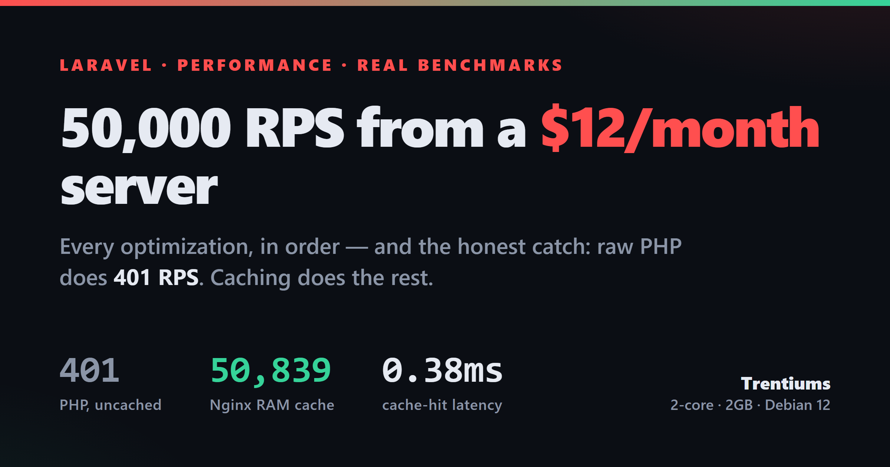

<p align="center">
  
</p>

<h1 align="center">Optimized Laravel App</h1>

<p align="center">
  <b>50,000+ RPS on a $12/month, 2-core / 2GB VPS.</b><br>
  A real Laravel 12 app tuned end-to-end — FrankenPHP, Nginx RAM cache, Cloudflare, Brotli, MariaDB, Redis.
</p>

<p align="center">
  
  
  
  
  
</p>

---

## What this is

A production Laravel 12 app (SwiftRide — taxi & tour booking) used as a **real-world performance case study**. The repo documents every optimization made to a budget VPS, with measured before/after numbers and reproducible configs.

The point isn't a magic number — it's the **honest breakdown**: the PHP app itself does **401 RPS**. Caching layers turn that into **50,000+ RPS** for public pages. The skill is architecting so PHP runs as rarely as possible.

## Benchmark results

Measured with `wrk -t4 -c100 -d30s` from a same-datacenter client (no internet latency):

| Layer | RPS | Avg latency | Notes |
|---|---:|---:|---|
| FrankenPHP (PHP app, uncached) | 401 | 24.9ms | actual application throughput |
| **Nginx RAM cache (HIT)** | **50,839** | **0.38ms** | served from `/dev/shm`, PHP never runs |
| Cloudflare edge cache | — | 82ms* | origin receives **zero** requests on a HIT |

<sub>*Cloudflare latency is geographic round-trip from a remote client, not server processing.</sub>

## The stack

```
Browser
  → Cloudflare Edge (free tier, nearest PoP)
  → Nginx (RAM micro-cache, Brotli, SSL termination)
  → Laravel Octane / FrankenPHP (4 workers, OPcache + preload)
  → Redis (cache, sessions, queues)
  → MariaDB (512MB buffer pool, tuned for 2GB RAM)
```

| Layer | Choice | Why |
|---|---|---|
| App server | FrankenPHP (Octane) | Unlocks OPcache preload that Swoole 6.x crashed on; mimalloc allocator |
| PHP | 8.5 + OPcache + JIT | Preload is the real win; JIT ~0–3% on I/O-bound Laravel |
| Edge cache | Nginx micro-cache in `/dev/shm` | RAM-backed; cache hits bypass PHP entirely (0.38ms) |
| CDN | Cloudflare free tier | One cache rule; origin offload to the edge |
| Compression | Brotli level 9 | 14.7% smaller HTML than gzip |
| HTML | Custom minify middleware | Strips whitespace/comments before caching |
| Database | MariaDB | 512MB pool, `O_DIRECT`, `flush=2` for latency |
| State | Redis | Separate DBs for cache / session / queue |

## Optimization steps

The full step-by-step journey, with configs and before/after numbers:

1. Swap Swoole → FrankenPHP (OPcache preload unblocked)
2. OPcache + JIT + preload tuning
3. Nginx RAM micro-cache (the biggest single win)
4. Cloudflare free-tier cache rule
5. Brotli level 9 compression
6. HTML minification middleware
7. MariaDB tuning for 2GB RAM
8. Redis multi-database separation
9. ProxySQL — measured, then *skipped* (when **not** to add a tool)
10. Tailwind CDN → Vite production build

→ Read the full writeup: **[LINKEDIN_ARTICLE.md](LINKEDIN_ARTICLE.md)**

## Documentation

| Doc | What's inside |
|---|---|
| [LINKEDIN_ARTICLE.md](LINKEDIN_ARTICLE.md) | The story: every step with real benchmarks and honest caveats |
| [PERFORMANCE_GUIDE.md](PERFORMANCE_GUIDE.md) | Generic playbook — push any Laravel app toward Go/Bun-class throughput |
| [SERVER_SETUP_GUIDE.md](SERVER_SETUP_GUIDE.md) | Reproduce the server from scratch (Nginx, Octane, MariaDB, Redis, SSL) |
| [upgrade.md](upgrade.md) | Upgrade notes |
| [linkedin-kit/](linkedin-kit/) | Promotion assets — posts, carousel + banner image generators |

## Quick start (local)

Requirements: PHP 8.2+, Composer, Node 18+, a database (MySQL/MariaDB), Redis (optional locally).

```bash
git clone https://github.com/bhargav960143/optimized-laravel-app.git
cd optimized-laravel-app

composer install
npm install

cp .env.example .env
php artisan key:generate
php artisan migrate

npm run build          # Vite production assets (Tailwind v4)
php artisan serve      # http://127.0.0.1:8000
```

For the full production stack (FrankenPHP, Nginx cache, Brotli, etc.) follow **[SERVER_SETUP_GUIDE.md](SERVER_SETUP_GUIDE.md)**.

## Key takeaways

1. **Caching layers multiply, not add.** Most requests never touch PHP.
2. **Test before adding workers.** 8 workers on 2 cores = same throughput, double RAM.
3. **Measure before adding tools.** ProxySQL/replicas don't help if that's not your bottleneck.
4. **The free tier is enough.** Cloudflare free + 2GB VPS + open-source stack.
5. **OPcache preload > JIT** for Laravel — it's I/O-bound, not CPU-bound.

## Marketing kit

`linkedin-kit/` contains ready-to-post assets and Node generators (headless Chrome, no npm deps):

```bash
node linkedin-kit/build-images.mjs    # → 10 carousel slides (1080x1080 @2x)
node linkedin-kit/build-banner.mjs    # → article banner (1200x630 @2x)
```

## License

Built on Laravel, open-sourced under the [MIT license](https://opensource.org/licenses/MIT).

---

<p align="center"><sub>Built by <a href="https://trentiums.com">Trentiums</a> · Laravel 12 · FrankenPHP · Nginx · MariaDB · Redis · Cloudflare · Debian 12</sub></p>
